<!--
█████████████████████████████████████████████████████████████████████████████████
█                                                                               █
█   THIS IS NOT A TEMPLATE. THIS IS VIVEK GHANTIWALA.                          █
█                                                                               █
█████████████████████████████████████████████████████████████████████████████████
-->

<div align="center">

<!-- HERO - Custom Animated Banner -->


<br/>

<!-- Dynamic Typing - Your Identity -->
<a href="https://git.io/typing-svg"></a>

<br/><br/>

<!-- Signature Badges -->


<br/><br/>

<!-- Visitor Counter -->


</div>

---

<br/>

<!-- ABOUT ME - Interactive Code Block -->
<div align="center">

##  WHO AM I

</div>

```python
#!/usr/bin/env python3
# -*- coding: utf-8 -*-
"""
@author: Vivek Ghantiwala
@file: about_me.py
@description: Not just another developer. A builder who ships.
"""

class VivekGhantiwala:
    """
    M.Sc Data Science & AI | Full-Stack Developer | Builder
    """

    def __init__(self):
        self.name = "Vivek Ghantiwala"
        self.location = "India 🇮🇳"
        self.education = "M.Sc in Data Science & Artificial Intelligence"
        self.role = "Full-Stack Developer → Data Scientist → AI Engineer"

        self.contact = {
            "📧 email": "vivekghantiwala14@gmail.com",
            "💼 linkedin": "linkedin.com/in/vivek-ghantiwala-763162264",
            "🐙 github": "github.com/VivekGhantiwala"
        }

    def what_i_do(self) -> list:
        return [
            "🔨 Build full-stack web applications",
            "🤖 Create AI-powered tools and frameworks",
            "📊 Analyze data to solve real problems",
            "🚀 Ship products, not just write code"
        ]

    def my_philosophy(self) -> dict:
        return {
            "principle_1": "Build first, announce later",
            "principle_2": "Code every single day",
            "principle_3": "Learn by doing, not watching",
            "principle_4": "Solve real problems, not tutorial problems"
        }

    def __str__(self):
        return "Developer who doesn't just learn — I BUILD."


if __name__ == "__main__":
    vivek = VivekGhantiwala()
    print(vivek)
    # Output: Developer who doesn't just learn — I BUILD.
```

---

<br/>

<!-- WHAT I'VE BUILT - The Showcase -->
<div align="center">

##  WHAT I'VE SHIPPED

### Real Products. Real Solutions. Real Impact.

<br/>

</div>

<!-- Project 1: DataPilot-AI -->
<table>
<tr>
<td width="50%">

<div align="center">

### 🤖 [DataPilot-AI](https://github.com/VivekGhantiwala/DataPilot-AI)

<br/>

<a href="https://github.com/VivekGhantiwala/DataPilot-AI">

</a>

<br/><br/>

**Comprehensive Python Framework for Data Analysis**

`Python` `Machine Learning` `AI` `Automation`

<br/>

✅ Automated data analysis pipelines
<br/>
✅ Machine learning model generation
<br/>
✅ AI-powered insights extraction
<br/>
✅ Production-ready framework

</div>

</td>
<td width="50%">

<div align="center">

### 🌾 [FreshConnect](https://github.com/VivekGhantiwala/FreshConnect)

<br/>

<a href="https://github.com/VivekGhantiwala/FreshConnect">

</a>

<br/><br/>

**Farm-to-Table MERN Marketplace**

`MongoDB` `Express` `React` `Node.js`

<br/>

✅ Multi-role platform (Farmers, Sellers, Hotels)
<br/>
✅ Real-time inventory management
<br/>
✅ Complete supply chain solution
<br/>
✅ Scalable architecture

</div>

</td>
</tr>
</table>

<br/>

<!-- Project 3: YumYumRank -->
<div align="center">

### 🍔 [YumYumRank](https://github.com/VivekGhantiwala/YumYumRank)

<br/>

<a href="https://github.com/VivekGhantiwala/YumYumRank">

</a>

<br/><br/>

**Full-Stack Food Health Rating Platform**

`HTML5` `CSS3` `JavaScript` `API Integration`

<br/>

✅ Nutritional analysis engine &nbsp;&nbsp;|&nbsp;&nbsp; ✅ Smart food alternatives &nbsp;&nbsp;|&nbsp;&nbsp; ✅ Health scoring system &nbsp;&nbsp;|&nbsp;&nbsp; ✅ User reviews & ratings

</div>

<br/>

---

<br/>

<!-- TECH STACK - Visual & Impressive -->
<div align="center">

##  TECH STACK

<br/>

### Languages I Speak


<br/><br/>

### Frameworks & Libraries


<br/><br/>

### Databases & Cloud


<br/><br/>

### Tools I Use Daily


<br/><br/>

### Currently Mastering


<br/>

**Data Science** • **Machine Learning** • **Deep Learning** • **Generative AI**

</div>

<br/>

---

<br/>

<!-- GITHUB STATS - Clean & Working -->
<div align="center">

##  GITHUB ANALYTICS

<br/>

<!-- Main Stats -->


<!-- Languages -->


<br/><br/>

<!-- Activity Graph -->


</div>

<br/>

---

<br/>

<!-- THE JOURNEY - Your Story -->
<div align="center">

##  THE JOURNEY

</div>

<br/>

<div align="center">

```
╔═══════════════════════════════════════════════════════════════════════════════════╗
║                                                                                   ║
║    📚  M.Sc in Data Science & Artificial Intelligence                            ║
║                                                                                   ║
║    Instead of paying ₹10+ Lakhs for bootcamps, I consolidated the curriculum     ║
║    from the world's BEST institutions and I'm teaching myself:                   ║
║                                                                                   ║
║         🎓 IIIT-Hyderabad                    🎓 MIT xPRO                          ║
║         🎓 Stanford University               🎓 DeepLearning.AI                  ║
║         🎓 Udacity Nanodegrees               🎓 Scaler Academy                   ║
║                                                                                   ║
║    No shortcuts. No excuses. No announcements until results.                     ║
║                                                                                   ║
║    "The grind doesn't need an audience."                                         ║
║                                                                                   ║
╚═══════════════════════════════════════════════════════════════════════════════════╝
```

</div>

<br/>

<!-- Learning Philosophy -->
<details>
<summary><h3>💡 Click to see how I learn</h3></summary>

<br/>

<div align="center">

| My Rule | What It Means |
|---------|---------------|
| **🔨 Build > Watch** | I don't binge tutorials. I build projects. |
| **📅 Daily Code** | Not a single day without writing code. |
| **🎯 Real Problems** | No Titanic datasets. Real world problems. |
| **🔇 Silent Grind** | I don't announce. I deliver. |
| **📈 Compound Growth** | 1% better daily = 37x better yearly. |

</div>

<br/>

**Curriculum worth:** ₹10-12 Lakhs

**My investment:** Discipline + Internet + Time

</details>

<br/>

---

<br/>

<!-- CONNECT - Make it Easy -->
<div align="center">

##  LET'S CONNECT

<br/>

*I'm always interested in collaborating on meaningful projects*

<br/><br/>

<!-- Contact Buttons -->
<a href="mailto:vivekghantiwala14@gmail.com">

</a>
&nbsp;&nbsp;
<a href="https://www.linkedin.com/in/vivek-ghantiwala-763162264/">

</a>
&nbsp;&nbsp;
<a href="https://github.com/VivekGhantiwala">

</a>

<br/><br/>

### 💼 Open To

**Internships** in Data Science / AI / ML
<br/>
**Entry-level roles** that challenge me
<br/>
**Collaborations** on projects that matter

<br/><br/>

📧 **vivekghantiwala14@gmail.com**

</div>

<br/>

---

<br/>

<!-- SIGNATURE QUOTE -->
<div align="center">

<br/>

###

```
                    ╭──────────────────────────────────────╮
                    │                                      │
                    │   "Everyone talks about AI.          │
                    │    I build with it."                 │
                    │                                      │
                    │              — Vivek Ghantiwala      │
                    │                                      │
                    ╰──────────────────────────────────────╯
```

<br/>

<!-- Footer Wave -->


</div>

<!--
╔═══════════════════════════════════════════════════════════════════════════════╗
║                                                                               ║
║   Thanks for scrolling this far!                                             ║
║   Star my repos if you find them interesting.                                 ║
║   Let's build something amazing together.                                     ║
║                                                                               ║
║   📧 vivekghantiwala14@gmail.com                                              ║
║                                                                               ║
╚═══════════════════════════════════════════════════════════════════════════════╝
-->
